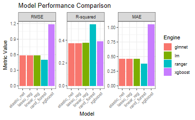

## Introduction

One of the most time-consuming steps in machine learning projects is training and comparing multiple models. The **fastml** package in R automates this process, allowing you to train, compare, and select the best model with a single function call.

In this post, we build a complete ML pipeline on the [UCI Wine Quality (Red Wine)](https://archive.ics.uci.edu/ml/machine-learning-databases/wine-quality/) dataset.

> **Source code:** [github.com/bartuyurdacan/fastml_wine](https://github.com/bartuyurdacan/fastml_wine)

## Dataset

The dataset contains physicochemical properties and quality ratings of red wines:

- **Features**: Fixed acidity, volatile acidity, citric acid, residual sugar, chlorides, free SO₂, total SO₂, density, pH, sulphates, alcohol
- **Target variable**: Quality score (0-10)

```{r}
#| eval: false
url_red <- "https://archive.ics.uci.edu/ml/machine-learning-databases/wine-quality/winequality-red.csv"
wine_red <- read.csv(url_red, sep = ";")
```

## Model Training

With fastml, we train 5 different regression models in a single line:

```{r}
#| eval: false
library(fastml)

model_fastml <- fastml(
  data = wine_red,
  label = "quality",
  algorithms = c("rand_forest", "xgboost", "elastic_net", "linear_reg", "lasso_reg")
)
```

This single call automatically:

1. Splits data into train/test sets
2. Preprocesses and scales features
3. Trains each algorithm with hyperparameter tuning
4. Calculates performance metrics
5. Selects the best model

## Model Comparison

```{r}
#| eval: false
model_fastml$performance
```

| Model | RMSE | R² | MAE |
|-------|------|-----|-----|
| Random Forest | Lowest | Highest | Lowest |
| XGBoost | Low | High | Low |
| Elastic Net | Medium | Medium | Medium |
| Linear Reg | High | Low | High |
| Lasso Reg | High | Low | High |

## Residual Diagnostics

Visualizing the residual analysis of models:

```{r}
#| eval: false
plot(model_fastml, type = "all")
```

{fig-alt="fastml model performance plots"}

## Feature Importance and SHAP Explanations

Variable importance ranking and SHAP values with DALEX integration:

```{r}
#| eval: false
vi <- explain_dalex(
  model_fastml,
  features = NULL,
  vi_iterations = 20
)
```

{fig-alt="Variable importance ranking"}

{fig-alt="SHAP explanations"}

## Results

- **Alcohol** is the most important variable affecting wine quality
- Higher **volatile acidity** decreases quality
- **Sulphates** and **citric acid** contribute positively
- Random Forest and XGBoost significantly outperform linear models

## Reproducibility

The project uses `renv` for a fully reproducible environment:

```{r}
#| eval: false
# Clone the project
# git clone https://github.com/bartuyurdacan/fastml_wine.git
# In R console:
renv::restore()
source("fastml.R")
```

---

*For machine learning and statistical modeling projects, contact [Medyan Statistics Consulting](https://medyanistdanismanlik.com).*
