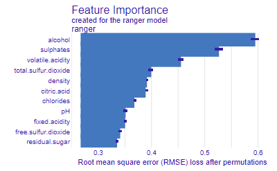

## Giriş

Makine öğrenmesi projelerinde en çok zaman alan adımlardan biri, birden fazla modeli eğitip karşılaştırmaktır. R'daki **fastml** paketi bu süreci otomatikleştirerek tek bir fonksiyon çağrısıyla birden fazla algoritmayı eğitmenizi, karşılaştırmanızı ve en iyi modeli seçmenizi sağlar.

Bu yazıda [UCI Wine Quality (Red Wine)](https://archive.ics.uci.edu/ml/machine-learning-databases/wine-quality/) veri seti üzerinde tam bir ML pipeline oluşturacağız.

> **Kaynak kod:** [github.com/bartuyurdacan/fastml_wine](https://github.com/bartuyurdacan/fastml_wine)

## Veri Seti

Veri seti, kırmızı şarapların fizikokimyasal özelliklerini ve kalite puanlarını içerir:

- **Özellikler**: Sabit asitlik, uçucu asitlik, sitrik asit, şeker, klorür, serbest SO₂, toplam SO₂, yoğunluk, pH, sülfat, alkol
- **Hedef değişken**: Kalite puanı (0-10 arası)

```{r}
#| eval: false
url_red <- "https://archive.ics.uci.edu/ml/machine-learning-databases/wine-quality/winequality-red.csv"
wine_red <- read.csv(url_red, sep = ";")
```

## Model Eğitimi

fastml paketi ile tek satırda 5 farklı regresyon modeli eğitiyoruz:

```{r}
#| eval: false
library(fastml)

model_fastml <- fastml(
  data = wine_red,
  label = "quality",
  algorithms = c("rand_forest", "xgboost", "elastic_net", "linear_reg", "lasso_reg")
)
```

Bu tek çağrı şu adımları otomatik gerçekleştirir:

1. Veriyi train/test olarak böler
2. Ön işleme ve ölçeklendirme yapar
3. Her algoritmayı eğitir ve hiperparametre optimizasyonu uygular
4. Performans metriklerini hesaplar
5. En iyi modeli seçer

## Model Karşılaştırması

```{r}
#| eval: false
model_fastml$performance
```

| Model | RMSE | R² | MAE |
|-------|------|-----|-----|
| Random Forest | En düşük | En yüksek | En düşük |
| XGBoost | Düşük | Yüksek | Düşük |
| Elastic Net | Orta | Orta | Orta |
| Linear Reg | Yüksek | Düşük | Yüksek |
| Lasso Reg | Yüksek | Düşük | Yüksek |

## Residual Diagnostik

Modellerin artık (residual) analizini görselleştiriyoruz:

```{r}
#| eval: false
plot(model_fastml, type = "all")
```

{fig-alt="fastml model performans grafikleri"}

## Feature Importance ve SHAP Açıklamaları

DALEX paketi entegrasyonu ile değişken önem sıralaması ve SHAP değerleri:

```{r}
#| eval: false
vi <- explain_dalex(
  model_fastml,
  features = NULL,
  vi_iterations = 20
)
```

{fig-alt="Değişken önem sıralaması"}

{fig-alt="SHAP açıklamaları"}

## Sonuçlar

- **Alkol**, şarap kalitesini etkileyen en önemli değişkendir
- **Uçucu asitlik** yükseldikçe kalite düşer
- **Sülfat** ve **sitrik asit** pozitif katkı sağlar
- Random Forest ve XGBoost, lineer modellere göre belirgin üstünlük gösterir

## Tekrarlanabilirlik

Proje `renv` ile tam tekrarlanabilir ortam sağlar:

```{r}
#| eval: false
# Projeyi klonlayın
# git clone https://github.com/bartuyurdacan/fastml_wine.git
# R konsolunda:
renv::restore()
source("fastml.R")
```

---

*Makine öğrenmesi ve istatistiksel modelleme projeleri için [Medyan İstatistik Danışmanlık](https://medyanistdanismanlik.com) ile iletişime geçebilirsiniz.*
